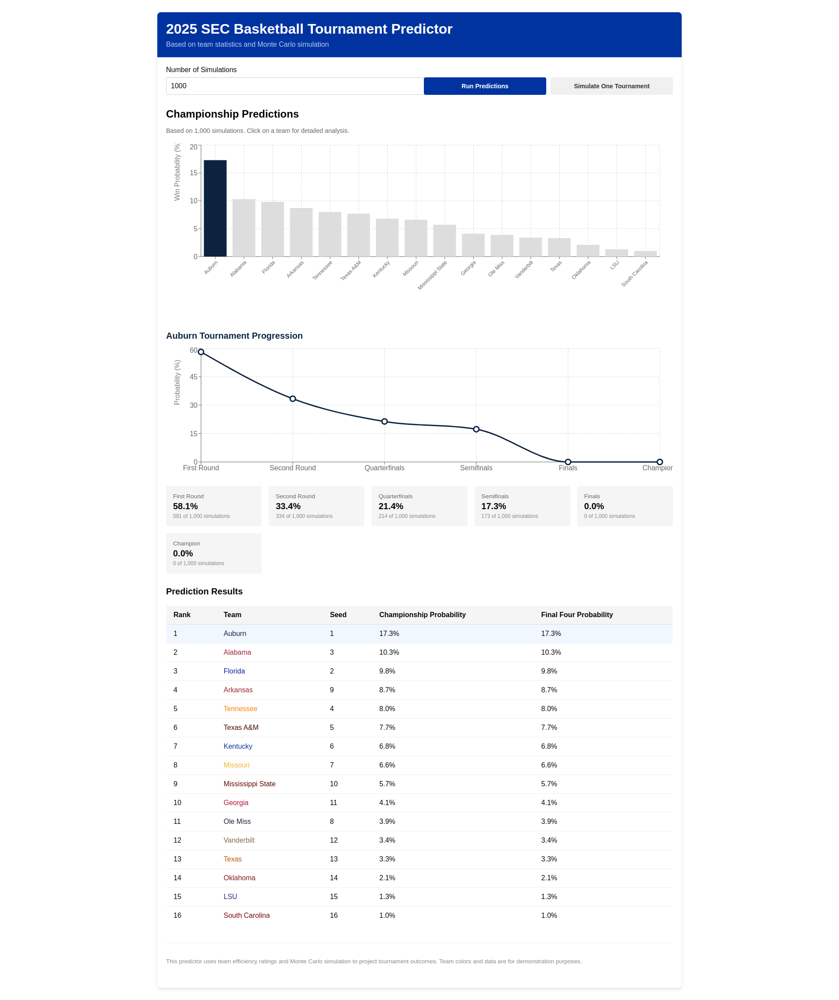

# SEC Tournament Predictor

This app uses Monte Carlo simulation to predict the 2025 SEC Men's Basketball Tournament.

## Prediction Results

## How to Run

1. Clone the repository
2. Navigate to this directory
3. Run `npm install` to install dependencies
4. Run `npm start` to launch the app
5. Open http://localhost:3000 in your browser

## Features
- Runs thousands of simulations to predict tournament outcomes
- Visualizes each team's chances of winning
- Shows detailed progression statistics for each team
- Can simulate individual tournament runs