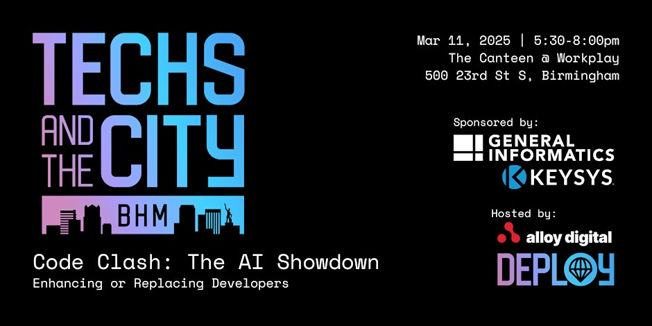
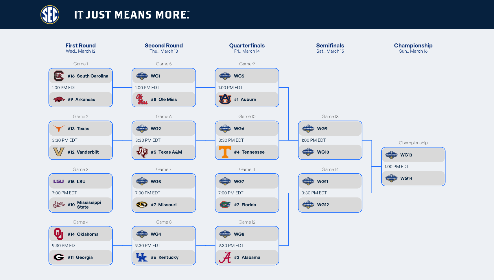

# Techs and the City BHM: Code Clash – The AI Showdown

**Date & Time:** March 11, 2025, 5:30 - 8:00 pm  
**Location:** The Canteen @ Workplay, 500 23rd St S, Birmingham, AL  

Sponsored by [General Informatics](https://geninf.com/) and [Keysys](https://keysys.io/)  
Hosted by [Alloy Digital](https://alloy.digital/) and [Deploy](https://deployalloy.com/)

---

## Overview

**Code Clash – The AI Showdown** was a lightning-fast coding challenge that explored how AI could enhance or replace traditional development workflows. Participants had **10 minutes** to create a functional predictor for the **2025 SEC Men’s Basketball Tournament**. They could use any language, framework, or tool—including AI-assisted coding tools.

For the full rules of the challenge, please see the [PDF of the challenge details](./TECHS%20AND%20THE%20CITY%20PRESENTS_%20%20Code%20Clash%20-%20The%20AI%20Showdown.pdf).

---

## Challenge Details

### Challenge Overview
> **The mission was**: Build a script, tool, or website that predicted the eventual winner of the 2025 SEC Men’s Basketball Tournament. Participants had full freedom in their approach—using external data, AI models, or any other resources.  

### Challenge Parameters
- **Goal:** Create a functional predictor for the 2025 SEC Men’s Basketball Tournament winner. Including round-by-round results to track team progress throughout the tournament.
- **Time Limit:** 10 minutes.
- **Tech Stack:** Any language, framework, or toolset is allowed.
- **Data Sources:** You can use any external data, but consider time constraints.
- **AI Assistance:** You may leverage AI-powered coding tools (e.g., ChatGPT, GitHub Copilot).
- **Evaluation Criteria:** Completeness, creativity, and accuracy of the prediction method.

### Final Thoughts
This 10-minute sprint was designed to push participants to think creatively under time pressure and leverage automation and AI. They were encouraged to have fun, learn something new, and see how quickly they could build a functional prediction tool.

---

## Tournament Bracket

