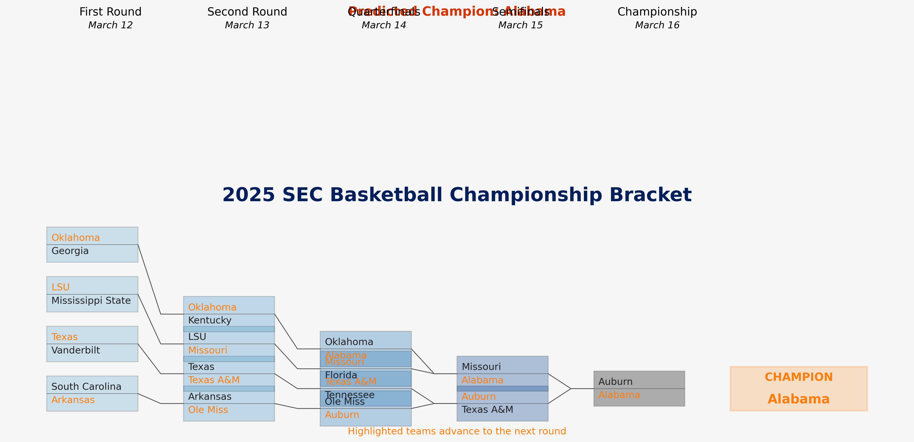
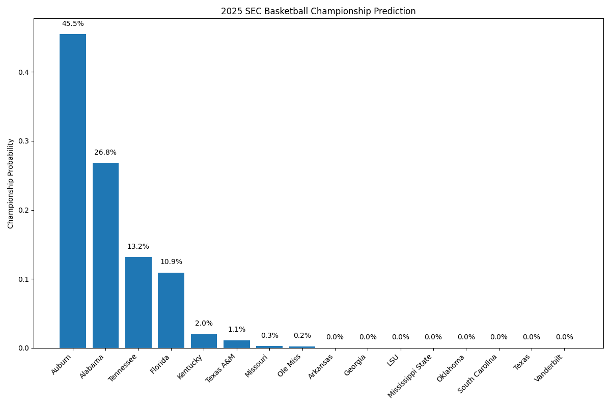

# SEC Basketball Championship Predictor



This program predicts the winner of the 2025 SEC Basketball Championship using statistical data from screenshots of secsports.com and an Elo rating system. It simulates the tournament 10,000 times and calculates each team's probability of winning the championship.

## Features

- Data extraction from statistical images using OCR
- Elo rating system for team strength evaluation
- 10,000 tournament simulations with probabilistic outcomes
- Visualization of championship probabilities
- Command-line interface with customizable options

## Requirements

- Python 3.6+
- Dependencies listed in `requirements.txt`
- Tesseract OCR engine (for image text extraction)

## Installation

1. Install the required Python packages:

```bash
pip install -r requirements.txt
```

2. Install Tesseract OCR:

   - **macOS**: `brew install tesseract`
   - **Linux**: `sudo apt-get install tesseract-ocr`
   - **Windows**: Download installer from [GitHub](https://github.com/UB-Mannheim/tesseract/wiki)

## Usage

Run the predictor with default settings:

```bash
python sec_tournament_predictor.py
```

To generate a tournament bracket visualization:

```bash
python generate_bracket.py
```

### Options

- `--stats`: Path to the folder containing statistical images (default: "stats")
- `--iterations`: Number of simulation iterations (default: 10000)
- `--fallback`: Use fallback data instead of OCR extraction

Example with custom options:

```bash
python sec_tournament_predictor.py --stats custom_stats_folder --iterations 5000
```

## Tournament Structure

The 2025 SEC Basketball Championship is a single-elimination tournament with all 16 SEC teams:

- **First Round (March 12th)**: South Carolina vs Arkansas, Texas vs Vanderbilt, LSU vs Mississippi State, Oklahoma vs Georgia
- **Second Round (March 13th)**: First round winners vs Ole Miss, Texas A&M, Missouri, Kentucky
- **Quarterfinals (March 14th)**: Second round winners vs Auburn, Tennessee, Florida, Alabama
- **Semifinals (March 15th)**
- **Championship (March 16th)**

## Output

The program produces:

- Console output showing each team's championship probability
- A bar chart visualization saved as `sec_championship_prediction.png`
- A tournament bracket visualization saved as `sec_bracket.png` (when running `generate_bracket.py`)

### Championship Probability Chart



### Tournament Bracket


